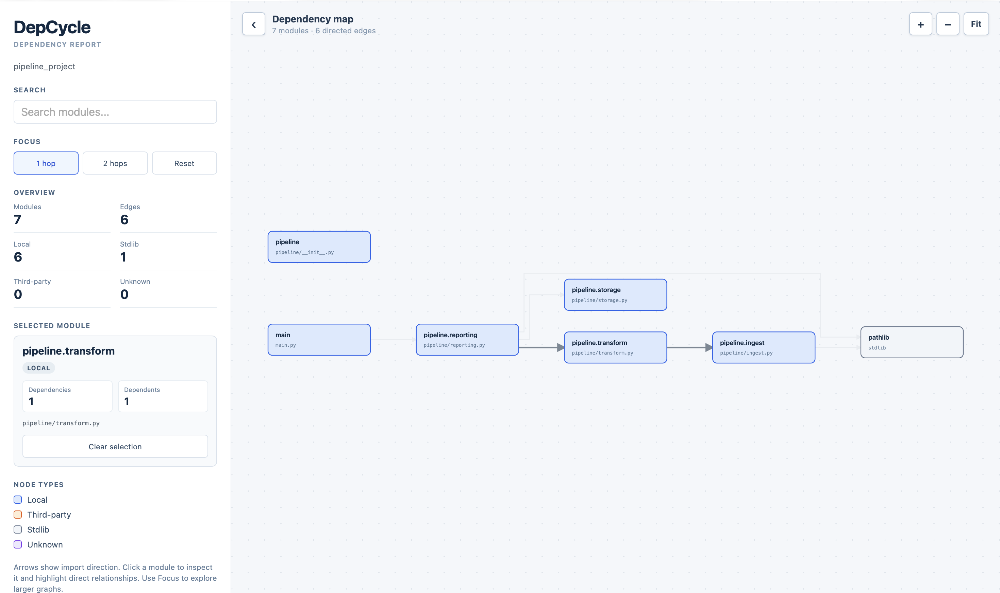
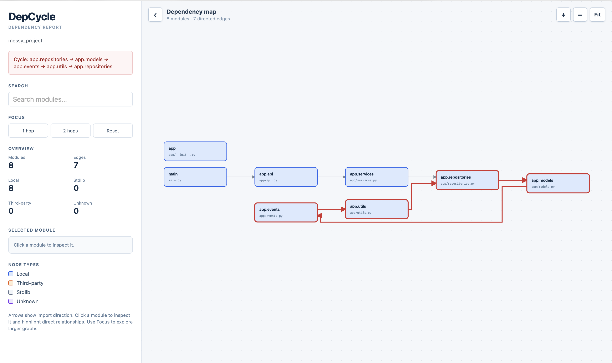
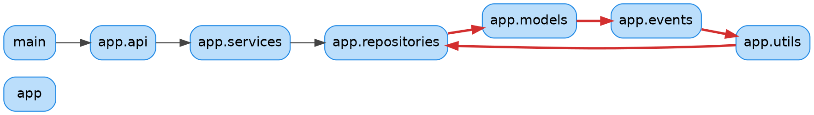
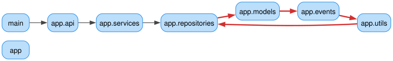

# DepCycle

[](https://pypi.org/project/depcycle/)
[](https://pypi.org/project/depcycle/)
[](https://github.com/Matricess/depcycle/actions/workflows/ci.yml)
[](https://opensource.org/licenses/MIT)

## What is DepCycle?

DepCycle is a command-line tool for understanding the dependencies inside a Python project.

It scans Python files, discovers imports, builds a dependency graph, identifies circular dependencies, and generates reports that you can explore or process.

The HTML report provides an interactive dependency map for exploring your project visually, while JSON and DOT provide formats that can be used with other tools and workflows.

It is designed to answer questions such as:

* Which modules depend on each other?
* Where are my circular dependencies?
* Which parts of the project depend on a particular module?
* How is the codebase connected?
* Which imports are local, standard-library, third-party, or unknown?

## See DepCycle in Action

DepCycle generates interactive dependency maps that make module relationships and circular dependencies easier to understand.

### Dependency Flow



### Circular Dependencies



The first example shows a layered dependency flow through a project. The second highlights a circular dependency directly in the graph.

## Installation

Install DepCycle from PyPI:

```bash
pip install depcycle
```

You can also use it through `uv`:

```bash
uv tool install depcycle
```

Check the installation:

```bash
depcycle --help
```

## Basic Usage

Run DepCycle against a Python project:

```bash
depcycle /path/to/your/project
```

By default, this creates:

```text
dependencies.html
```

Open that file in a browser to explore the dependency graph.

You can also choose the output file explicitly:

```bash
depcycle /path/to/your/project -o project-dependencies.html
```

## Interactive HTML Report

The HTML report provides an interactive dependency map for exploring a project visually.

The report provides an interactive dependency map with:

* Left-to-right dependency flow
* Zoom and pan
* Fit-to-view
* Module search
* Click-to-highlight dependencies and dependents
* 1-hop and 2-hop focus modes
* Module details
* Cycle highlighting
* Collapsible information panel
* Drag-and-reposition nodes

Nodes are visually classified as:

| Type        | Meaning                                     |
| ----------- | ------------------------------------------- |
| Local       | Module belonging to the analyzed project    |
| Stdlib      | Python standard-library module              |
| Third-party | Dependency identified from project metadata |
| Unknown     | Dependency that could not be classified     |

Circular dependencies are highlighted directly in the graph so they are easy to investigate.

## Output Formats

### HTML

Generate an interactive HTML report:

```bash
depcycle /path/to/your/project -f html -o dependencies.html
```

This is the best format for visually exploring the dependency graph.

### JSON

Generate machine-readable output:

```bash
depcycle /path/to/your/project -f json -o dependencies.json
```

The JSON report contains the project summary, nodes, edges, and detected cycles.

### DOT

Generate a dependency graph in DOT format:

```bash
depcycle /path/to/your/project -f dot -o dependencies.dot
```

For example, DepCycle can produce DOT output like this:



The DOT output can also be rendered as an SVG:

```bash
dot -Tsvg dependencies.dot -o dependencies.svg
```

For the same graph:



The generated SVG can be viewed directly in a browser or included in documentation and other workflows.


## Finding Circular Dependencies

DepCycle automatically checks the dependency graph for cycles.

For example:

```text
⚠️  Warning: Found 1 circular dependency cycles!
    Cycle 1: app.repositories → app.models → app.events → app.utils → app.repositories
```

The same cycle is highlighted in the HTML and DOT output.

## Filtering Dependencies

By default, DepCycle shows local modules, standard-library modules, third-party dependencies, and unknown dependencies.

Hide third-party dependencies:

```bash
depcycle /path/to/your/project --no-third-party
```

Hide standard-library modules:

```bash
depcycle /path/to/your/project --no-stdlib
```

You can combine these:

```bash
depcycle /path/to/your/project \
  --no-third-party \
  --no-stdlib
```

## Excluding Files and Directories

DepCycle automatically excludes common generated and environment directories such as:

```text
.venv
venv
env
__pycache__
.git
node_modules
dist
build
tests
```

You can add your own exclusion patterns:

```bash
depcycle /path/to/your/project -e tests -e "generated/*.py"
```

You can specify `--exclude` multiple times.

To disable the built-in exclusions and analyze everything except the patterns you explicitly provide:

```bash
depcycle /path/to/your/project --include-all
```

## Project Dependencies

DepCycle can use common Python project metadata to recognize third-party dependencies.

Supported metadata includes:

* `pyproject.toml`
* `requirements.txt`
* `requirements-*.txt`
* `setup.cfg`
* `setup.py`
* `Pipfile`

This helps DepCycle distinguish project modules from external packages.

## Choosing the Output Format Automatically

DepCycle can infer the format from the output filename.

For example:

```bash
depcycle /path/to/your/project -o dependencies.json
```

produces JSON, while:

```bash
depcycle /path/to/your/project -o dependencies.dot
```

produces DOT.

Without an output extension or explicit format, HTML is used.

You can always specify the format explicitly:

```bash
depcycle /path/to/your/project \
  --format html \
  --output dependencies.html
```

## Writing to Standard Output

Use `-` as the output path to write the selected format to standard output:

```bash
depcycle /path/to/your/project -f json -o -
```

This is useful when piping the output into another command or tool.

## Command-Line Help

See all available options:

```bash
depcycle --help
```

## Typical Workflow

A simple workflow is:

```bash
depcycle /path/to/your/project
```

Then open:

```text
dependencies.html
```

Start by looking for:

1. Large dependency clusters
2. Modules with many incoming or outgoing dependencies
3. Circular dependencies highlighted in red
4. External dependencies mixed into the graph

Clicking a module lets you inspect its direct relationships and explore the surrounding part of the graph.

## Requirements

DepCycle supports Python 3.10 and newer.

## License

DepCycle is licensed under the MIT License.

See [LICENSE](LICENSE) for the full license text.
